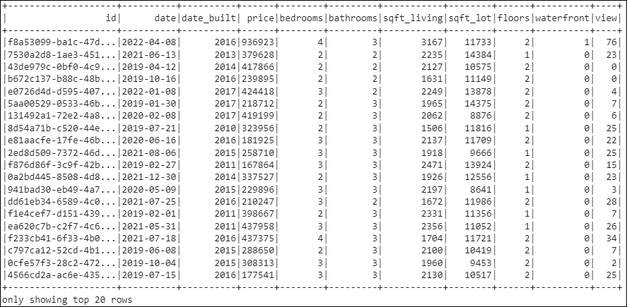
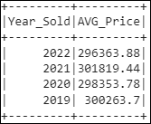
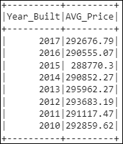
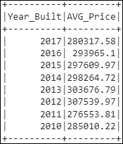
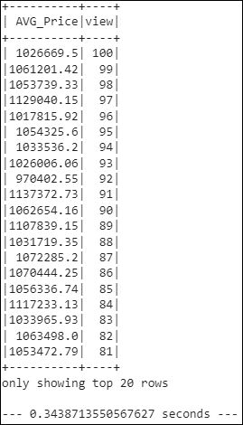
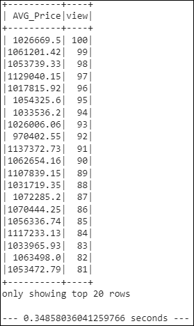
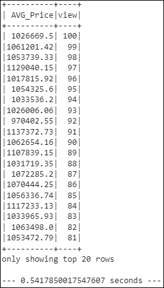

# home_sales

### Scenario

In this challenge, you'll use your knowledge of SparkSQL to determine key metrics about home sales data. Then you'll use Spark to create temporary views, partition the data, cache and uncache a temporary table, and verify that the table has been uncached.

------

### Instructions

- Rename the `Home_Sales_starter_code.ipynb` file as `Home_Sales.ipynb`.
- Import the necessary PySpark SQL functions for this assignment.
- Read the `home_sales_revised.csv` data in the starter code into a Spark DataFrame.
    - 
- Create a temporary table called `home_sales`.
- Answer the following questions using SparkSQL:
    - What is the average price for a four-bedroom house sold for each year? Round off your answer to two decimal places.
        - 
    - What is the average price of a home for each year it was built that has three bedrooms and three bathrooms? Round off your answer to two decimal places.
        - 
    - What is the average price of a home for each year that has three bedrooms, three bathrooms, two floors, and is greater than or equal to 2,000 square feet? Round off your answer to two decimal places.
        - 
    - What is the "view" rating for homes costing more than or equal to $350,000? Determine the run time for this query, and round off your answer to two decimal places.
        - 
        - **Runtime:** `0.3438713550567627 seconds`
- Cache your temporary table `home_sales`.
- Check if your temporary table is cached.
- Using the cached data, run the query that filters out the view ratings with an average price of greater than or equal to $350,000. Determine the runtime and compare it to uncached runtime.
    - 
    - **Runtime:** `0.34858036041259766 seconds`
    - Comparison to the uncached runtime:
        - `0.0047` seconds slower
- Partition by the "date_built" field on the formatted parquet home sales data.
- Create a temporary table for the parquet data.
- Run the query that filters out the view ratings with an average price of greater than or equal to $350,000. Determine the runtime and compare it to uncached runtime.
    - 
    - **Runtime:** `0.5417850017547607`
    - Comparison to the uncached runtime:
        - `0.1979` seconds slower
- Uncache the `home_sales` temporary table.
- Verify that the `home_sales` temporary table is uncached using PySpark.
- Download your `Home_Sales.ipynb` file and upload it into your "Home_Sales" GitHub repository.
   
--------

## References

| Reference Name | Description |
|----------------|-------------|
| edX Boot Camps LLC | Dataset generation and starter files |
| [PySpark](https://spark.apache.org/docs/latest/api/python/index.html) | *PySpark is the Python API for Apache Spark. It enables you to perform real-time, large-scale data processing in a distributed environment using Python. It also provides a PySpark shell for interactively analyzing your data.* |